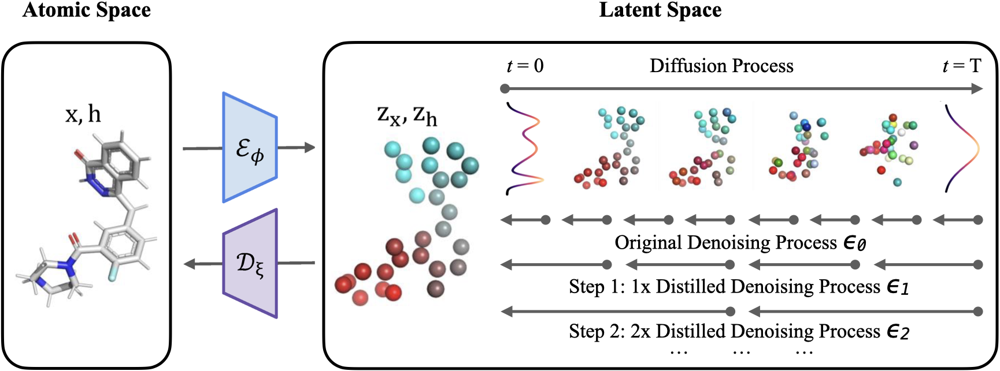

# Accelerated GeoLDM

## Accelerating the Generation of Molecular Conformations with Progressive Distillation of Equivariant Latent Diffusion Models

[](https://github.com/MinkaiXu/GeoLDM/blob/main/LICENSE)
[](https://arxiv.org/abs/2404.13491)



Official code release for the paper `Accelerating the Generation of Molecular Conformations with Progressive Distillation of Equivariant Latent Diffusion Models`, accepted at the *Generative and Experimental Perspectives for Biomolecular Design Workshop* at the *12th International Conference on Learning Representations, 2024*.

## Environment

Install the required packages from `requirements.txt`. A simplified version of the requirements can be found [here](https://github.com/ehoogeboom/e3_diffusion_for_molecules/blob/main/requirements.txt).

**Note**: If you want to set up a rdkit environment, it may be easiest to install conda and run:
``conda create -c conda-forge -n my-rdkit-env rdkit`` and then install the other required packages. But the code should still run without rdkit installed though.


## Distill the Accelerated GeoLDM

### Download pretrained models

We used pretrained models from the [GeoLDM paper](https://github.com/MinkaiXu/GeoLDM) trained on the QM9 dataset. 

You can download them from [here](https://drive.google.com/drive/folders/1EQ9koVx-GA98kaKBS8MZ_jJ8g4YhdKsL?usp=sharing). You can load them for running progressive distillation and evaluations by putting them in the `outputs` folder and setting the argument `--model_path` to the path of the pretrained model `outputs/$exp_name`.


### Progressive distillation

To run progressive distillation of the 1000 steps teacher model (`/qm9_1000`) to a 500 steps distillation model, run:

```python main_progdistill.py --n_epochs 25 --n_stability_samples 50 --diffusion_noise_schedule polynomial_2 --diffusion_noise_precision 1e-5 --diffusion_steps 500 --diffusion_loss_type l2 --batch_size 64 --nf 256 --n_layers 9 --lr 1e-4 --normalize_factors [1,4,10] --test_epochs 4 --ema_decay 0.9999 --train_diffusion --latent_nf 2 --exp_name qm9_500 --teacher_path outputs/qm9_1000```

Then adapt the `--diffusion_steps` flag to 250, 125, etc. in subsequent halvings, while adapting the teacher model to be the student model from the previous distillation run (`/qm9_500`, then `/qm9_250`, etc.).


## Evaluate Accelerated GeoLDMmodels

To analyze the sample quality of molecules generated by the model `outputs/$exp_name`:

```python eval_analyze.py --model_path outputs/$exp_name --n_samples 10_000```

To visualize some molecules:

```python eval_sample.py --model_path outputs/$exp_name --n_samples 10_000```

Small note: The GPUs used for these experiment were pretty large. If you run out of GPU memory, try running at a smaller size.


## Citation
Please consider citing the our paper if you find it helpful. Thank you!

```
@misc{lacombe2024accelerating,
      title={Accelerating the Generation of Molecular Conformations with Progressive Distillation of Equivariant Latent Diffusion Models}, 
      author={Romain Lacombe and Neal Vaidya},
      year={2024},
      eprint={2404.13491},
      archivePrefix={arXiv},
      primaryClass={q-bio.QM}
}
```

## Acknowledgements

This repo is built upon the previous work [GeoLDM](https://github.com/MinkaiXu/GeoLDM). Thanks to the authors for their great work!